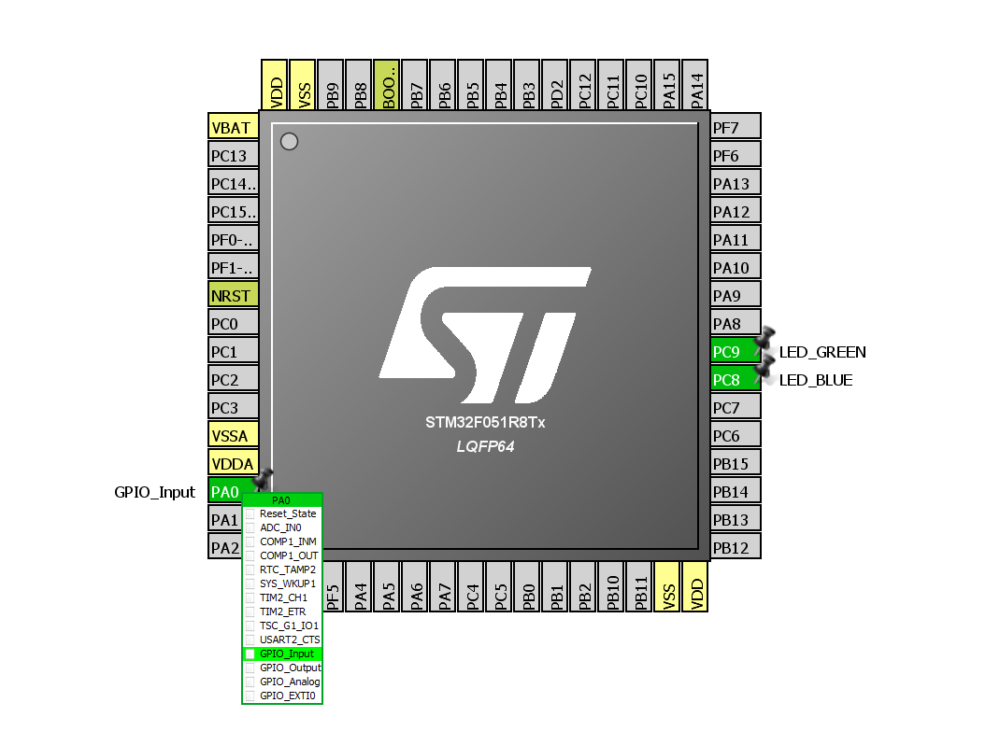

## STM32 HAL polled input reading ##

This project uses polled principle input pin reading.

Learning objectives:
- GPIO input (a push button)

STM32F051C8 LQFP64 processor on the STM32F0Discovery board was used for developing.

Project configuration:

